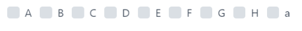
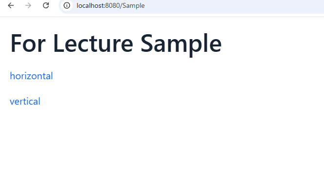
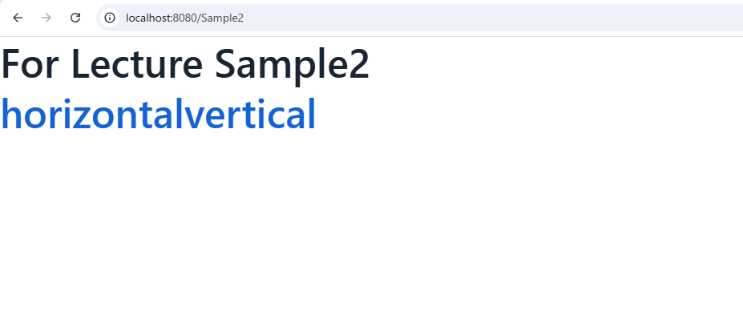

# Vaadin資料
[Vaadin資料](#vaadin資料)
- [Vaadinのコンポーネント(一部)](#vaadinのコンポーネント一部)

  -  [レイアウトコンポーネント(Layouts)](#レイアウトコンポーネントlayouts)

  - [データ入力コンポーネント(Data Entry)](#データ入力コンポーネントdata-entry)

  - [データ表示・インタラクションコンポーネント(Visualization & Interaction)](#データ表示インタラクションコンポーネントvisualization--interaction)

  - [標準HTMLコンポーネント](#標準htmlコンポーネント)

- [Vaadinのコンポーネントの機能](#vaadinのコンポーネントの機能)

- [リスナー](#イベントハンドリング)

- [ページの作成方法](#ページの作成方法)

## Vaadinのコンポーネント(一部) 
詳しくはこのリンクで調べてください。
https://vaadin.com/docs/latest/components

### レイアウトコンポーネント(Layouts)
- #### VerticalLayout
  - レイアウトのコンポーネント. 縦並びにしたいときにこれを使う。
  ~~~
  var verticalLayout = new VerticalLayout(); 
  ~~~
  ※ 例ではインスタンス変数名をコンポーネント名に揃えていますが、必ず揃える必要があるわけではありません。
  極論、以下のようでも動作します。(これは他のコンポーネントでも同様です)
  ~~~
  var vL = new VerticalLayout();
  ~~~

- #### HorizontalLayout
  - レイアウトのコンポーネント. 横並びにしたいときにこれを使う。
  ~~~
  var horizontalLayout = new HorizontalLayout(); 
  ~~~

- #### FormLayout
  - レイアウトのコンポーネント. フォームのレイアウトはこれが良さげ
  ~~~
  var formLayout = new FormLayout();
  ~~~

 [ページ最上へ戻る](#vaadin資料)

### データ入力コンポーネント(Data Entry)
- #### TextField・MailField・PasswordField
  - 入力のためのコンポーネント
パスワードの入力はパスワードフィールド、メールアドレスの入力はメールフィールド、それ以外
はテキストフィールドで大丈夫だと思う。
  ~~~
  var textField = new TextField();
  var mailField = new MailField();
  var passwordField = new PasswordField();
  ~~~

- #### CheckBox
  - チェックボックスのコンポーネント
チェックボックス・ラジオボタンなど複数の要素を含むものは、大体～～Boxというクラスがあり、それで管理します。
  ~~~
  var checkboxGroup = new CheckboxGroup<>();
  checkboxGroup.setItems
    ("A", "B", "C", "D", "E", "F", "G", "H");
  var checkbox = new Checkbox("a");
  checkboxGroup.add(checkbox);
  add(checkboxGroup);
  ~~~
  

 [ページ最上へ戻る](#vaadin資料)

### データ表示・インタラクションコンポーネント(Visualization & Interaction)
- #### Button
  - ボタンのためのコンポーネント。addClickListenerメソッドのリスナーでクリックに対しての操作を記述可能

- #### Grid
  - グリッド表示のためのコンポーネント
- #### 標準HTMLコンポーネント(下記URL参照)
  - https://vaadin.com/docs/latest/flow/create-ui/standard-html

- #### H1~H6
  - H1~H6タグに対応するコンポーネント
- #### Paragraph
  - pタグに対応するコンポーネント
- #### Anchor
  - aタグに対応するコンポーネント. Element APIを使用すると、HtmlContainerを使用して任意の標準HTML要素を作成できます

例
~~~
var input = new HtmlContainer("input");
~~~

他にもHtmlクラスを用いれば、文字列でHTMLを書くことも可能です。

例
~~~
var html = new Html("
pタグの作成
");
~~~

 [ページ最上へ戻る](#vaadin資料)

### Vaadinのコンポーネントの機能
Vaadinのコンポーネントはadd(Component... components)といったメソッドを持っており、これを
使用してコンポーネントを追加できます。

また、コンポーネントのset～～のメソッドでHTMLの属性やCSSを変えることができます。

コンポーネントのメソッドにないCSSを変えたいときは、下記のようにスタイルにセットします。
~~~
button.getStyle().setBorder("3px solid #000");
button.getStyle().set("border", "3px solid #000");
~~~
※どちらも同じ操作になります。
3pxやborder,solod,#000などの意味は、自分で調べてみよう。

 [ページ最上へ戻る](#vaadin資料)

### イベントハンドリング
コンポーネントは対応するリスナーを持っていて、それの処理をラムダ式・無名関数などで記述可能です。 
※ 今回の処理は、ボタンをクリックすると他のページに遷移する処理になっています。
~~~
var sampleButton = new Button("case:ラムダ式");
        sampleButton.addClickListener(e ->
                UI.getCurrent().getPage().setLocation("Sample")
        );

var sampleButton2 = new Button("case:無名関数");
sampleButton.addClickListener(new ComponentEventListener<ClickEvent<Button>>() {
    @Override
    public void onComponentEvent(ClickEvent<Button> buttonClickEvent) {
        UI.getCurrent().getPage().setLocation("Sample2");
    }
});
~~~

また、引数として受け取ったイベントはイベントごとに必要な情報を保持してくれています。
~~~
var passwordField = new PasswordField();
passwordField.addValueChangeListener(e -> {
    e.getValue();
    e.getOldValue();
});
~~~ 
valueChangeEventの場合、今の値と変わる前の値などを保持してくれる。

 [ページ最上へ戻る](#vaadin資料)

### ページの作成方法
Vaadinのページを作るには、下記のようにVaadinのコンポーネントを継承して、それにRouteアノテーションをつければ、作ることができます。
~~~
package com.example.application.views.main;

import com.vaadin.flow.component.html.Anchor;
import com.vaadin.flow.component.html.H1;
import com.vaadin.flow.component.orderedlayout.VerticalLayout;
import com.vaadin.flow.router.PageTitle;
import com.vaadin.flow.router.Route;

@PageTitle("For Lecture Sample")
@Route("Sample")
public class ForLectureView extends VerticalLayout {
    public ForLectureView() {
        var viewName = new H1("For Lecture Sample");
        var toHorizontal = new Anchor("horizontal", "horizontal");
        var toVertical = new Anchor("vertical", "vertical");
        add(viewName, toHorizontal, toVertical);
    }
}
~~~
※ PageTitleアノテーションはページを作るために必須ではないです。
addを忘れるとそのコンポーネントはページに追加されないので注意

次のようにH1などの大見出しでページを作ることもできますが、レイアウトコンポーネントの
VerticalLayout、HorizontalLayoutを使った方が良いと思います。

ログイン機能
読んでください。
https://vaadin.com/docs/latest/flow/security/enabling-security

~~~
package com.example.application.views.main;

import com.vaadin.flow.component.html.Anchor;
import com.vaadin.flow.component.html.H1;
import com.vaadin.flow.router.Route;
import com.vaadin.flow.server.auth.AnonymousAllowed;

@Route("Sample2")
@AnonymousAllowed
public class ForLectureViewSecond extends H1 {
    public ForLectureViewSecond() {
        var layoutName = new H1("For Lecture Sample2");
        var toHorizontal = new Anchor("horizontal", "horizontal");
        var toVertical = new Anchor("vertical", "vertical");
        add(layoutName, toHorizontal, toVertical);
    }
}
~~~

小ネタ：上のURLにあるlocalhost:8080の意味は、自分自身のPC(localhost)をサーバとして、8080番ポート(テスト用http接続ポート)にアクセスするという意味。localhostは`ドメイン名`であり、その実態は127.0.0.1という自分自身を指し示す`IPアドレス`で、ループバックアドレスという。`サーバクライアントモデル`では`DNS(ドメインネームシステム)`という、`IPアドレスという数字の羅列をドメイン名というわかりやすい名前に対応させる仕組み`がある。ドメイン名からIPアドレスを引く`正引き`、IPアドレスからドメイン名を引く`逆引き`がある。このような仕組みがあるので、URLではドメイン名を打っても、IPアドレスを打っても同じ場所に接続可能である。

 [ページ最上へ戻る](#vaadin資料)
