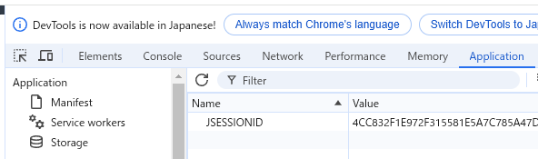

# ユーザ追加フォームを作成する 03

ユーザ作成後の確認画面を作成する。

## UserMakerPage を編集する。
以下の `import` を追加する。
```java
import com.vaadin.flow.component.UI;
import com.vaadin.flow.server.VaadinSession;
```

ボタンの処理を以下のように修正する。具体的には、`Notification.show` より下の2行が追加内容。
```java
Button submitButton = new Button("新規ユーザ登録");
submitButton.addClickListener(clickEvent -> {
    var userName = userNameField.getValue();
    var userPass = userPassField.getValue();
    var msg = "入力データ：" + userName + "," + userPass;
    System.out.println(msg);
    Notification.show("以下の入力とともにボタンが押されました" + "\n" + msg);
    VaadinSession.getCurrent().setAttribute("makedUserName", userName);
    UI.getCurrent().getPage().setLocation("UserMakerComp");
});
```

上記追加行の処理は以下の通り。

- `VaadinSession.getCurrent().setAttribute("hoge", huga)` これは、Vaadinの現行セッションに属性をセットする記述である。
`VaadinSession.getCurrent()` はVaadinで自分が現在持っているセッションを取得するメソッドなので、使う頻度が高い。
`setAttribute("hoge", huga)` は第一引数が属性名(文字列型)、第二引数がその属性の内容をそれぞれ渡す。
これにより自分が現在持っているセッションに属性とその内容を保持させることができる。

- `UI.getCurrent().getPage().setLocation("Hoge")` これは、ページ遷移を行う記述である。`setLocation()` の引数に`@Route` で記述した文字列を渡すことで、そのアノテーションがあるページに遷移する。この記法以外にも、`UI.getCurrent().navigate(Huga.class)` という書き方もある。これは、あるページのクラスに遷移するという記述である。ただし、この記法では何らかの理由でページクラスを差し替えるが、元のページも残しておきたいというときにクラス名の管理が面倒になる。<br>
しかし `setLocation("Hoge")` だと、`@Route` の文字列を書き換えるだけでいいので差し替えが楽である。


## UserMakerCompPage.java を作成する。

ここまでの知識を使い、どのように動作するページか予測しながら作成してみるとよい。

```java
package com.example.vsbp.page;

import com.vaadin.flow.component.UI;
import com.vaadin.flow.component.button.Button;
import com.vaadin.flow.component.html.H1;
import com.vaadin.flow.component.html.NativeLabel;
import com.vaadin.flow.component.notification.Notification;
import com.vaadin.flow.component.orderedlayout.VerticalLayout;
import com.vaadin.flow.router.Route;
import com.vaadin.flow.component.textfield.TextField;
import com.vaadin.flow.server.VaadinSession;

@PageTitle("UserMakerComp")
@Route("UserMakerComp")
public class UserMakerCompPage extends VerticalLayout {

    public UserMakerCompPage() {

        var headLine = new H1("登録が完了されました");

        // 現在のセッションにおけるユーザ名の取得
        var userName = (String) VaadinSession.getCurrent().getAttribute("makedUserName");

        // nullチェックを追加
        if (userName == null) {
            headLine = new H1("ユーザ作成ができていません");
            userName = "不明なユーザー"; // デフォルト値を設定
            Notification.show("セッションにユーザー名が設定されていません。デフォルト値を使用します。");
        }

        VaadinSession.getCurrent().setAttribute("makedUserName", null);

        add(headLine);

        // ユーザー名ラベルの作成
        NativeLabel userNameLabel = new NativeLabel("ユーザー名: " + userName);
        add(userNameLabel);

        // 比較用　ラベル使用時の表示とテキストフィールドでの表示の違い
        var nameField = new TextField("ユーザ名");
        nameField.setValue(userName);
        nameField.setReadOnly(true);
        add(nameField);

        // ホームページへ遷移するボタンの作成(12/26現在ボタン機能せず)
        var toHomeButton = new Button("ホームに戻る", e -> {
            UI.getCurrent().getPage().setLocation("/"); // setLocationで "/"をしているが、これはルート=rootで、Route("")のページにとばす
        });
        add(toHomeButton);
    }
}
```

上記コードの処理内容は以下の通り。

- `(String) VaadinSession.getCurrent().getAttribute("userName")` これは、上述した `UserMakerPage` での `setAttribute("hoge", huga)` に対応する関数で、指定した属性の値を取得する。いわゆるセッターとゲッターというやつである。
注意点は、`(String)` で文字列型にキャストしていることである。理由は、`getAttribute` の戻り値は`Object型` だからである。

- UserMakerPageを経由せずUserMakerCompPageにアクセスされたときに、`(String) VaadinSession.getCurrent().getAttribute("userName")`はNullになってしまう。そこで、Nullチェックを追加し、Nullであった場合にheadLineの内容を書き換え、userNameを不明なユーザとして表示するようにしている。また、このページを表示した後に再びUserMakerCompを表示する場合、`makedUserName`属性の内容が残ったままだとUserMakerPageを経由せずとも同じメッセージが表示されるので、`VaadinSession.getCurrent().setAttribute("makedUserName", null)`で内容をnullに戻している。

- 上記コードでは `NativeLabel` と `TextField` の2パターンで表示を行っている。`NativeLabel` はHTML準拠の表示方式であり、単純な文字表示を行う。対して `TextField` は、Vaadin準拠の表示形式で表示される。`TextField` は `setValue()`でシステム側で自動的に値を入れておくことができる。また `setReadOnly(true)` で読み取り専用にできる。

- ボタンの作成の部分で、`addClickListener` を記述していないことがわかると思う。これはボタンコンポーネントの作成記述時点で第二引数にラムダ式を渡し、`addClickListener` を省略しているわけである。処理の意味は同じなのでどちらで書いても構わないが、`addClickListener` を用いたほうが可読性は高くなるような気がする。(最後にまとめて処理内容を書くこともできるし……)


## ここまでの動作確認

vsbpApplciation を再起動する。

Webブラウザで [http://localhost:8080/](http://localhost:8080/) にアクセスし、 ユーザを新規追加 リンクを押して、 `UserMakerPage` が表示される。<br>
各フィールドに何らかの文字を入力してみて、ボタンをクリックするとユーザ登録完了後のページに遷移することを確認する。<br>
(表示されるユーザ名が`UserMakerPage`で入力したユーザ名であることも確認する。)


## 重要な概念

たびたび現れるセッションというものだが、これはサーバとユーザの間に保持される関係である。この概念は`サーバクライアントモデル`において**非常に重要な**ものである。ウェブページには「**ステートレス**」と「**ステートフル**」の2つがある。ステートとは日本語で「状態」という意味だが、このステートレス、ステートフルとはまさに状態が「レス」なのか、「フル」なのかの違いある。<br>
`サーバはユーザに固有のセッションIDを割り当て、サーバとユーザはそのセッションIDを保持し、サーバがそれを照合することでユーザを追跡し、表示する情報をユーザに合わせて変化させる`。

- 「**ステートレス**」は状態を保持しない、つまり同じユーザであってもセッションを保持せずに毎回セッションを更新する方式である。

- 「**ステートフル**」は上述したようにセッションIDの照合でサーバがユーザを追跡する方式で、セッションの情報(ステート)を保持しているため、そこから情報を取り出すことができる。

ここまで作成してきたVaadinのページはステートフルであり、ユーザのサインイン処理前とサインイン処理後の間以外ではセッションIDの更新はない。セッションIDの確認方法は、当該ページで`F12`を押すことでデベロッパツールを開き、`Application > Storage > Cookies > http～` から確認できる。



[目次へ戻る](../README.md)  &emsp;&emsp;[前の項目へ](./02.md) &emsp;&emsp;[次の項目へ](./04.md)
