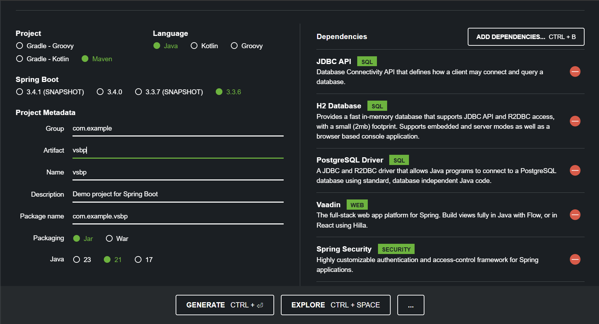

# 環境設定

## Spring Bootのプロジェクトを作成する。

[Spring Initializr](https://start.spring.io/) アクセスする。

- Project を `maven` にする
- Language を `Java` にする
- Spring Boot を `3.3.x` の最新版（xは、時期によって変わる。SNAPSHOTは除く）
- Artifact を `vsbp` にする
- Java を `21` にする
- Search for dependencies に `JDBC` を入力し、 `JDBC API` を選択
- Search for dependencies に `h2` を入力し、 `H2 Database` を選択
- Search for dependencies に `Post` を入力し、 `PostgreSQL Driver` を選択
- Search for dependencies に `Vaadin` を入力し、 `Vaadin` を選択
- Search for dependencies に `Spring` を入力し、 `Spring Security` を選択

画像は最新版でない可能性があるので、上記の情報をもとにプロジェクトを作成してください。


Generateボタンを押して、vsbp.zipファイルをダウンロードする。
ダウンロードした vsbp.zip は展開する。

## IDEでプロジェクトを読み込む
intellij IDEAの場合
- ファイル > 開く で、vsbp.zipを展開したフォルダ内のpom.xmlを選択する。
- Mavenプロジェクトを自動的にインポートする(import Maven projects automatically)にチェックして続行。

## pom.xmlファイルを編集する
生成したSpring Bootプロジェクトは、 Maven というプロジェクト管理ツールで作られる。

Mavenの設定ファイル **pom.xml** が、 IntelliJ に読み込んだwsbpプロジェクトにも存在しているので、これを変更する。変更する箇所が多いので注意。

変更ミスがあると、うまく動かない原因になるので、スペルミスなどが怖い時はコピペ推奨。


### 1 `<version>...</version>` を削除し、 `<packaging>...</packaging>` を追加する

書き換え前

```xml
<groupId>com.example</groupId>
<artifactId>vsbp</artifactId>
<version>0.0.1-SNAPSHOT</version>
<name>vsbp</name>
```

書き換え後

```xml
<groupId>com.example</groupId>
<artifactId>vsbp</artifactId>
<name>vsbp</name>
<packaging>war</packaging>
```

- ここの **`<version>0.0.1-SNAPSHOT</version>` を削除** し、`<packaging>war</packaging>` を足していることに注意！

### 2 `<properties>...</properties>` にプロジェクト設定、実行形式ファイル名への日時形式を挿入する

書き換え前

```xml
<properties>
		<java.version>21</java.version>
		<vaadin.version>24.5.8</vaadin.version>
</properties>
```

書き換え後（java.version , vaadin.versionは元々のままにし、それ以下を付け足す）

```xml
<properties>
  <java.version>21</java.version>
  <!-- プロジェクトでは基本的にUTF-8を使う -->
  <project.build.sourceEncoding>UTF-8</project.build.sourceEncoding>
  <project.reporting.outputEncoding>UTF-8</project.reporting.outputEncoding>
  <!-- 実行形式ファイル名につける日時の形式を指定する -->
  <maven.build.timestamp.format>yyyyMMdd-HHmmss</maven.build.timestamp.format>
</properties>
```

### 3 `<build>...</build>` を書き換える

#### 3-1 実行形式ファイル名 `<finalName>...</finalName>` と `<configuration>...</configuration>` を追加する

- filename ではなく **final**name であることに注意。

変更前

```xml
<build>
    <plugins>
        <plugin>
            <groupId>org.springframework.boot</groupId>
            <artifactId>spring-boot-maven-plugin</artifactId>
        </plugin>
    </plugins>
</build>
```

変更後

```xml
<build>
  <!-- 実行形式ファイル名を設定する -->
  <finalName>${project.artifactId}-${maven.build.timestamp}</finalName>
  <plugins>
    <plugin>
      <groupId>org.springframework.boot</groupId>
      <artifactId>spring-boot-maven-plugin</artifactId>
      　<!-- Spring-Bootプロジェクトを、executable-warとしてビルドする -->
        <configuration>
          <executable>true</executable>
        </configuration>
    </plugin>
  </plugins>
</build>
```

#### 3-2 HTMLファイルをクラスパスに組み込めるようにする `<resources>...</resources>`

変更前

```xml
<build>
  <!-- 実行形式ファイル名を設定する -->
　<finalName>${project.artifactId}-${maven.build.timestamp}</finalName>
  <plugins>
    <!-- 中略 -->  
  </plugins>
</build>
```

変更後

- つまり、**`<plugins>...</plugins>` の直後に、`<resources>...</resources>` を追加する**ことに注意！

```xml
<build>
  <!-- 実行形式ファイル名を設定する -->
  <finalName>${project.artifactId}-${maven.build.timestamp}</finalName>
  <plugins>
    <!-- 中略 -->
  </plugins>

  <!-- ビルドの際に、htmlファイルをクラスフォルダに含める -->
  <resources>
    <resource>
      <directory>src/main/resources</directory>
    </resource>
    <resource>
      <directory>src/main/java</directory>
      <includes>
        <include>**</include>
      </includes>
      <excludes>
        <exclude>**/*.java</exclude>
      </excludes>
    </resource>
  </resources>
</build>
```

### 4 '<dependency> </dependency>'の一部をコメントアウトする

変更前
```xml
<dependencies>
  <!-- 中略 -->

  <dependency>
      <groupId>org.springframework.boot</groupId>
      <artifactId>spring-boot-starter-security</artifactId>
  </dependency>

  <!-- 中略 -->

  <dependency>
      <groupId>org.springframework.security</groupId>
      <artifactId>spring-security-test</artifactId>
      <scope>test</scope>
  </dependency>

  <!-- 中略 -->
```

変更後
```xml
<dependencies>
  <!-- 中略 -->

  <!--<dependency>
      <groupId>org.springframework.boot</groupId>
      <artifactId>spring-boot-starter-security</artifactId>
  </dependency>-->

  <!-- 中略 -->

  <!--<dependency>
      <groupId>org.springframework.security</groupId>
      <artifactId>spring-security-test</artifactId>
      <scope>test</scope>
  </dependency>-->

  <!-- 中略 -->
```

- 該当箇所を選択し、ctrl + Shift + / を押すとコメントアウトできる。
- 以降のパートで操作するため、削除でなくコメントアウトする。

## Springの設定を行う（いらないかも、要検証、俺の試作ファイルは書いてない）

springの設定は、src > main > resources フォルダの application.properties ファイルに記載する。


## 補足

- pom.xmlの内容が少しでも間違っていると、以後の手順でうまく動かないときがある。その場合は、[模範回答ファイル（つくってないよ！）](../../wsbp/pom.xml)をコピーして使ってもよい。
- Mavenについて理解したい場合は、Java Doで公開している[ビルドツールハンズオン：Maven](https://speakerdeck.com/gishi_yama/birudoturuhanzuon-apache-maven)などを参照するとよい。

## その他
- IntelliJ IDEAの使い方は [IntelliJ IDEAの使い方](https://pleiades.io/help/idea/meet-intellij-idea.html) の 初心者向け > [IntelliJ IDEA を理解する](https://pleiades.io/help/idea/discover-intellij-idea.html) を読むと良い。
- 自分のPCにIntelliJ IDEAをインストールしている学生は、日本語化をしてもよい。
  - [JetBrains 製品の日本語化マニュアル](https://pleiades.io/pages/pleiades_jetbrains_manual.html)
    - OSによって日本語化方法は異なるので、自分のOSにあわせて。

