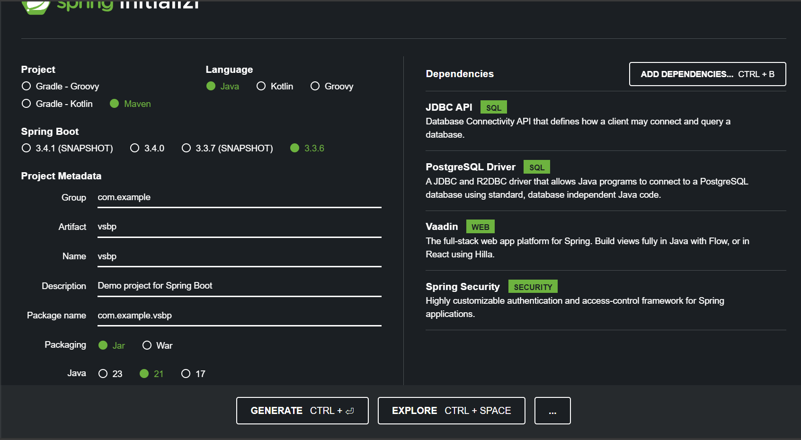
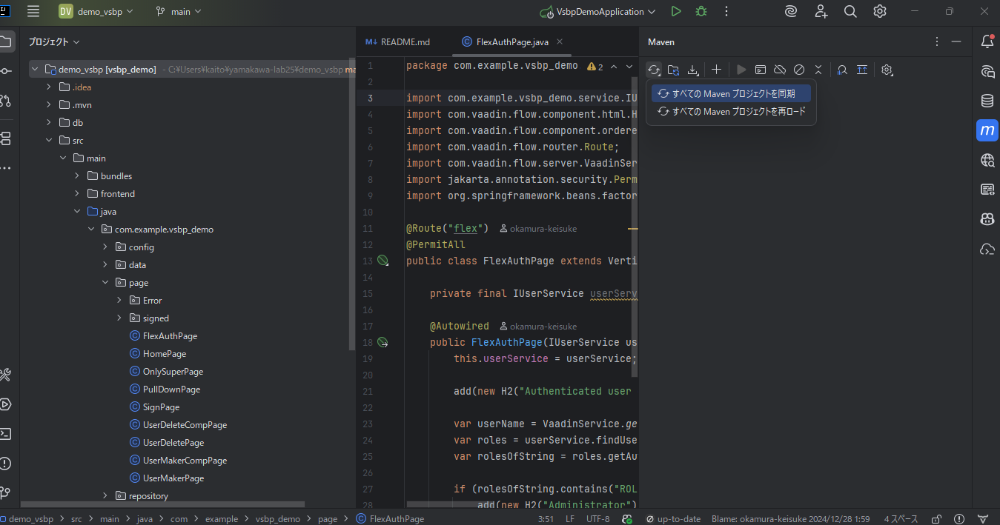

# 環境設定

## Spring Bootのプロジェクトを作成する。

[Spring Initializr](https://start.spring.io/) アクセスする。

- Project を `maven` にする
- Language を `Java` にする
- Spring Boot を stable の最新版にする（SNAPSHOT、M3などの文字がついていないバージョン）
- Artifact を `vsbp` にする
- Java を `21` にする
- Search for dependencies に `JDBC` を入力し、 `JDBC API` を選択
- Search for dependencies に `Post` を入力し、 `PostgreSQL Driver` を選択
- Search for dependencies に `Vaadin` を入力し、 `Vaadin` を選択
- Search for dependencies に `Spring` を入力し、 `Spring Security` を選択

画像は最新版でない可能性があるので、上記の情報をもとにプロジェクトを作成してください。


Generateボタンを押して、vsbp.zipファイルをダウンロードする。
ダウンロードした vsbp.zip は展開する。

## IDEでプロジェクトを読み込む
intellij IDEAの場合
- ファイル > 開く で、vsbp.zipを展開したフォルダ内のpom.xmlを選択する。
- Mavenプロジェクトを自動的にインポートする(import Maven projects automatically)にチェックして続行。

## pom.xmlファイルを編集する
生成したSpring Bootプロジェクトは、 Maven というプロジェクト管理ツールで作られる。

Mavenの設定ファイル **pom.xml** が、 IntelliJ に読み込んだvsbpプロジェクトにも存在する。<br>
これはSpring Initializerがプロジェクト名や選択した言語、プロジェクト管理ツール、依存関係(Dependencies)に基づいて生成してくれたものである。

### Vaadinのバージョンを確認する（整合性のため）

変更前
```xml
<!-- 中略 -->

	<properties>
		<java.version>21</java.version>
		<vaadin.version>24.x.y</vaadin.version>
	</properties>

<!-- 中略 -->
```

変更後
```xml
<!-- 中略 -->

	<properties>
		<java.version>21</java.version>
		<vaadin.version>24.9.3</vaadin.version>
	</properties>

<!-- 中略 -->
```

### Spring Bootのバージョンを確認する（整合性のため）

変更前
```xml
<!-- 中略 -->

	<parent>
		<groupId>org.springframework.boot</groupId>
		<artifactId>spring-boot-starter-parent</artifactId>
		<version>3.x.x</version>
		<relativePath/> <!-- lookup parent from repository -->
	</parent>

<!-- 中略 -->
```

変更後
```xml
<!-- 中略 -->

	<parent>
		<groupId>org.springframework.boot</groupId>
		<artifactId>spring-boot-starter-parent</artifactId>
		<version>3.5.6</version>
		<relativePath/> <!-- lookup parent from repository -->
	</parent>

<!-- 中略 -->
```


###  `<dependency> </dependency>`の一部をコメントアウトする

変更前
```xml
<dependencies>
  <!-- 中略 -->

  <dependency>
      <groupId>org.springframework.boot</groupId>
      <artifactId>spring-boot-starter-security</artifactId>
  </dependency>

  <!-- 中略 -->

  <dependency>
      <groupId>org.springframework.security</groupId>
      <artifactId>spring-security-test</artifactId>
      <scope>test</scope>
  </dependency>

  <!-- 中略 -->
```

変更後
```xml
<dependencies>
  <!-- 中略 -->

  <!--<dependency>
      <groupId>org.springframework.boot</groupId>
      <artifactId>spring-boot-starter-security</artifactId>
  </dependency>-->

　<!-- 中略 -->

  <!--<dependency>
      <groupId>org.springframework.security</groupId>
      <artifactId>spring-security-test</artifactId>
      <scope>test</scope>
  </dependency>-->

  <!-- 中略 -->
```

- ※注意 中略の部分はコメントアウトしない（つまり、上記Dependencyのみコメントアウトする）
- 該当箇所を選択し、ctrl + Shift + / を押すとコメントアウトできる。
- 以降のパートで操作するため、削除でなくコメントアウトする。
pom.xmlを変更した際は、必ずプロジェクトの同期 or 再ロードを行ってください。プロジェクトの同期/再ロードは依存関係の変更を反映する際に必要であるため、今後pomを変更する手順がある場合は、同様に同期/再ロードを行ってください。IntelliJ IDEAでの画面は以下のような感じです。<br>

もし、今後の手順で意図した動作をしないということがあれば、pomファイルの中身を[pom.xmlの見本](../demo_vsbp/pom.xml)を参照してみてください。本資料執筆時から、上述した依存関係以外にもダウンロード時のバージョンが異なり依存関係同士で整合性が取れない可能性があります。

（Vaadinのバージョンについては、別ブランチにVaadin側のバージョンを落とすのではなく、SpringBoot側のバージョンを合わせる方法も書いておきます。）



## その他
- IntelliJ IDEAの使い方は [IntelliJ IDEAの使い方](https://pleiades.io/help/idea/meet-intellij-idea.html) の 初心者向け > [IntelliJ IDEA を理解する](https://pleiades.io/help/idea/discover-intellij-idea.html) を読むと良い。
- 自分のPCにIntelliJ IDEAをインストールしている学生は、日本語化をしてもよい。
  - [JetBrains 製品の日本語化マニュアル](https://pleiades.io/pages/pleiades_jetbrains_manual.html)
    - OSによって日本語化方法は異なるので、自分のOSにあわせて。


[目次へ戻る](../README.md)  &emsp;&emsp;[前の項目へ](./Spring.md) &emsp;&emsp;[次の項目へ](./データベース01.md)
